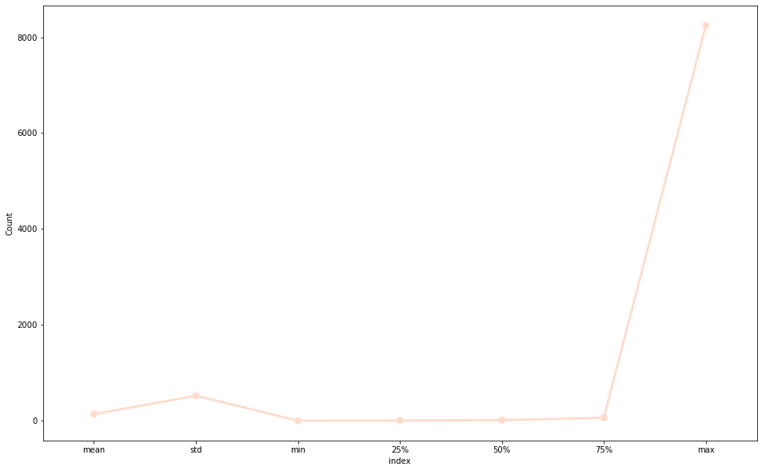
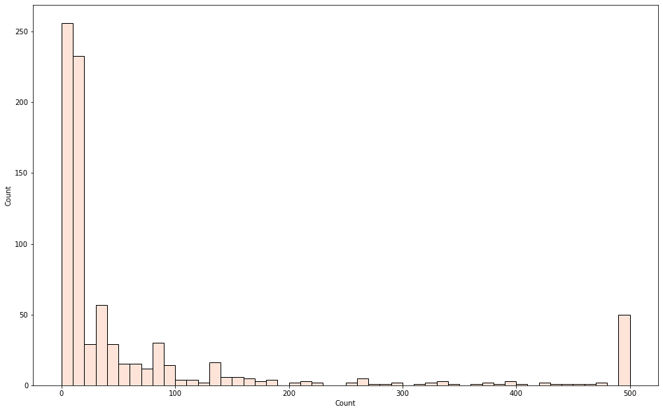
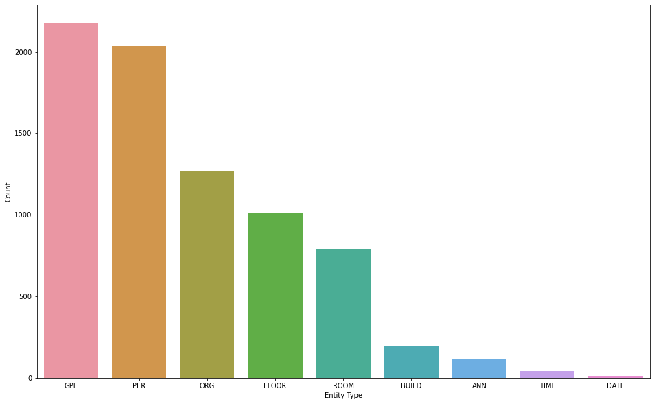
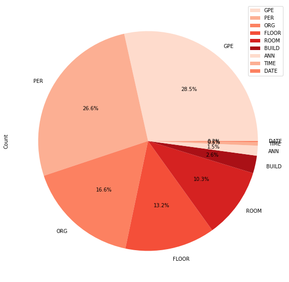

# Named Entity Recognition


```python
# ---------------------------------------------------------------------------- #
#                               Imports and setup                              #
# ---------------------------------------------------------------------------- #


# pandas
import pandas as pd

# seaborn
import seaborn as sns
sns.set_palette('Reds')

# numpy
import numpy as np

# matplotlib
import matplotlib.pyplot as plt
from matplotlib.axes._axes import _log as matplotlib_axes_logger

plt.rcParams["figure.figsize"] = (16, 10)
matplotlib_axes_logger.setLevel('ERROR')

# parse dataset
%run "src/generate_detailed_stats.py"

words_count_data, entity_types_count_data, max_length = collect_stats("entity-tag")
```


```python
words_count = pd.DataFrame.from_dict(words_count_data, orient="index").sort_values(0, ascending=False).reset_index()
words_count.columns = ["Word", "Count"]

entity_types_count = pd.DataFrame.from_dict(entity_types_count_data, orient="index").sort_values(0, ascending=False).reset_index()
entity_types_count.columns = ["Entity Type", "Count"]
```

## Words


```python
words_count.select_dtypes("number").describe()
```


<div>
<style scoped>
    .dataframe tbody tr th:only-of-type {
        vertical-align: middle;
    }

    .dataframe tbody tr th {
        vertical-align: top;
    }

    .dataframe thead th {
        text-align: right;
    }
</style>
<table border="1" class="dataframe">
  <thead>
    <tr style="text-align: right;">
      <th></th>
      <th>Count</th>
    </tr>
  </thead>
  <tbody>
    <tr>
      <th>count</th>
      <td>831.000000</td>
    </tr>
    <tr>
      <th>mean</th>
      <td>137.947052</td>
    </tr>
    <tr>
      <th>std</th>
      <td>522.017931</td>
    </tr>
    <tr>
      <th>min</th>
      <td>1.000000</td>
    </tr>
    <tr>
      <th>25%</th>
      <td>6.000000</td>
    </tr>
    <tr>
      <th>50%</th>
      <td>13.000000</td>
    </tr>
    <tr>
      <th>75%</th>
      <td>62.000000</td>
    </tr>
    <tr>
      <th>max</th>
      <td>8245.000000</td>
    </tr>
  </tbody>
</table>
</div>


```python
def plot_stats():
    stats = words_count.select_dtypes("number").describe()
    stats.reset_index(inplace=True)
    stats = stats[stats["index"] != "count"]
    
    for col in stats.columns[1:]:
        sns.pointplot(data=stats, x="index", y=col)
    
plot_stats()
```


    

    


```python
with pd.option_context('display.max_rows', None, 'display.max_columns', None):
    display(words_count)
```


<div>
<style scoped>
    .dataframe tbody tr th:only-of-type {
        vertical-align: middle;
    }

    .dataframe tbody tr th {
        vertical-align: top;
    }

    .dataframe thead th {
        text-align: right;
    }
</style>
<table border="1" class="dataframe">
  <thead>
    <tr style="text-align: right;">
      <th></th>
      <th>Word</th>
      <th>Count</th>
    </tr>
  </thead>
  <tbody>
    <tr>
      <th>0</th>
      <td>តើ</td>
      <td>8245</td>
    </tr>
    <tr>
      <th>1</th>
      <td>មាន</td>
      <td>6000</td>
    </tr>
    <tr>
      <th>2</th>
      <td>នៅ</td>
      <td>4920</td>
    </tr>
    <tr>
      <th>3</th>
      <td>ទេ</td>
      <td>4441</td>
    </tr>
    <tr>
      <th>4</th>
      <td>ឬ</td>
      <td>3157</td>
    </tr>
    <tr>
      <th>5</th>
      <td>ណា</td>
      <td>2560</td>
    </tr>
    <tr>
      <th>6</th>
      <td>ប្រទេស</td>
      <td>2538</td>
    </tr>
    <tr>
      <th>7</th>
      <td>បាន</td>
      <td>2393</td>
    </tr>
    <tr>
      <th>8</th>
      <td>អត់</td>
      <td>2097</td>
    </tr>
    <tr>
      <th>9</th>
      <td>អ្នក</td>
      <td>1978</td>
    </tr>
    <tr>
      <th>10</th>
      <td>បន្ទប់</td>
      <td>1973</td>
    </tr>
    <tr>
      <th>11</th>
      <td>កន្លែង</td>
      <td>1945</td>
    </tr>
    <tr>
      <th>12</th>
      <td>អាច</td>
      <td>1940</td>
    </tr>
    <tr>
      <th>13</th>
      <td>ទី</td>
      <td>1890</td>
    </tr>
    <tr>
      <th>14</th>
      <td>របស់</td>
      <td>1704</td>
    </tr>
    <tr>
      <th>15</th>
      <td>ខ្លះ</td>
      <td>1681</td>
    </tr>
    <tr>
      <th>16</th>
      <td>ប្រាប់</td>
      <td>1601</td>
    </tr>
    <tr>
      <th>17</th>
      <td>ដែល</td>
      <td>1490</td>
    </tr>
    <tr>
      <th>18</th>
      <td>ពិត</td>
      <td>1405</td>
    </tr>
    <tr>
      <th>19</th>
      <td>ជាន់</td>
      <td>1329</td>
    </tr>
    <tr>
      <th>20</th>
      <td>ដោយ</td>
      <td>1295</td>
    </tr>
    <tr>
      <th>21</th>
      <td>ជា</td>
      <td>1128</td>
    </tr>
    <tr>
      <th>22</th>
      <td>ត្រូវ</td>
      <td>1120</td>
    </tr>
    <tr>
      <th>23</th>
      <td>មួយ</td>
      <td>1119</td>
    </tr>
    <tr>
      <th>24</th>
      <td>បង្កើត</td>
      <td>1090</td>
    </tr>
    <tr>
      <th>25</th>
      <td>មែន</td>
      <td>1069</td>
    </tr>
    <tr>
      <th>26</th>
      <td>ខ្ញុំ</td>
      <td>1039</td>
    </tr>
    <tr>
      <th>27</th>
      <td>អ្វី</td>
      <td>971</td>
    </tr>
    <tr>
      <th>28</th>
      <td>លោក</td>
      <td>943</td>
    </tr>
    <tr>
      <th>29</th>
      <td>កម្ម</td>
      <td>914</td>
    </tr>
    <tr>
      <th>30</th>
      <td>ខាង</td>
      <td>912</td>
    </tr>
    <tr>
      <th>31</th>
      <td>សួរ</td>
      <td>841</td>
    </tr>
    <tr>
      <th>32</th>
      <td>សុំ</td>
      <td>836</td>
    </tr>
    <tr>
      <th>33</th>
      <td>ថា</td>
      <td>826</td>
    </tr>
    <tr>
      <th>34</th>
      <td>រ៉ូបូត</td>
      <td>798</td>
    </tr>
    <tr>
      <th>35</th>
      <td>វិធី</td>
      <td>771</td>
    </tr>
    <tr>
      <th>36</th>
      <td>រៀន</td>
      <td>745</td>
    </tr>
    <tr>
      <th>37</th>
      <td>ជួយ</td>
      <td>734</td>
    </tr>
    <tr>
      <th>38</th>
      <td>បង</td>
      <td>724</td>
    </tr>
    <tr>
      <th>39</th>
      <td>នេះ</td>
      <td>708</td>
    </tr>
    <tr>
      <th>40</th>
      <td>តាំង</td>
      <td>700</td>
    </tr>
    <tr>
      <th>41</th>
      <td>ពី</td>
      <td>695</td>
    </tr>
    <tr>
      <th>42</th>
      <td>បន្តិច</td>
      <td>680</td>
    </tr>
    <tr>
      <th>43</th>
      <td>ការ</td>
      <td>609</td>
    </tr>
    <tr>
      <th>44</th>
      <td>វិទ្យា</td>
      <td>583</td>
    </tr>
    <tr>
      <th>45</th>
      <td>ឯង</td>
      <td>558</td>
    </tr>
    <tr>
      <th>46</th>
      <td>សម្រាប់</td>
      <td>540</td>
    </tr>
    <tr>
      <th>47</th>
      <td>បង្គន់</td>
      <td>536</td>
    </tr>
    <tr>
      <th>48</th>
      <td>គ្រូ</td>
      <td>532</td>
    </tr>
    <tr>
      <th>49</th>
      <td>នឹង</td>
      <td>497</td>
    </tr>
    <tr>
      <th>50</th>
      <td>ស្ថាន</td>
      <td>476</td>
    </tr>
    <tr>
      <th>51</th>
      <td>មនុស្ស</td>
      <td>472</td>
    </tr>
    <tr>
      <th>52</th>
      <td>ឫ</td>
      <td>469</td>
    </tr>
    <tr>
      <th>53</th>
      <td>សិក្សា</td>
      <td>459</td>
    </tr>
    <tr>
      <th>54</th>
      <td>ធ្វើ</td>
      <td>447</td>
    </tr>
    <tr>
      <th>55</th>
      <td>យន្ត</td>
      <td>433</td>
    </tr>
    <tr>
      <th>56</th>
      <td>Robot</td>
      <td>423</td>
    </tr>
    <tr>
      <th>57</th>
      <td>គេ</td>
      <td>422</td>
    </tr>
    <tr>
      <th>58</th>
      <td>នោម</td>
      <td>402</td>
    </tr>
    <tr>
      <th>59</th>
      <td>រក</td>
      <td>396</td>
    </tr>
    <tr>
      <th>60</th>
      <td>ស្អី</td>
      <td>395</td>
    </tr>
    <tr>
      <th>61</th>
      <td>អាគារ</td>
      <td>391</td>
    </tr>
    <tr>
      <th>62</th>
      <td>ប្រជុំ</td>
      <td>388</td>
    </tr>
    <tr>
      <th>63</th>
      <td>ឯ</td>
      <td>379</td>
    </tr>
    <tr>
      <th>64</th>
      <td>និង</td>
      <td>374</td>
    </tr>
    <tr>
      <th>65</th>
      <td>លើ</td>
      <td>363</td>
    </tr>
    <tr>
      <th>66</th>
      <td>ដី</td>
      <td>343</td>
    </tr>
    <tr>
      <th>67</th>
      <td>ថ្មី</td>
      <td>337</td>
    </tr>
    <tr>
      <th>68</th>
      <td>ប៉ុន្មាន</td>
      <td>331</td>
    </tr>
    <tr>
      <th>69</th>
      <td>Robotតើ</td>
      <td>330</td>
    </tr>
    <tr>
      <th>70</th>
      <td>ការណ៍</td>
      <td>328</td>
    </tr>
    <tr>
      <th>71</th>
      <td>ប្រាកដ</td>
      <td>324</td>
    </tr>
    <tr>
      <th>72</th>
      <td>ផ្នែក</td>
      <td>319</td>
    </tr>
    <tr>
      <th>73</th>
      <td>លេខ</td>
      <td>297</td>
    </tr>
    <tr>
      <th>74</th>
      <td>ទឹក</td>
      <td>290</td>
    </tr>
    <tr>
      <th>75</th>
      <td>រឿង</td>
      <td>288</td>
    </tr>
    <tr>
      <th>76</th>
      <td>ហេតុ</td>
      <td>278</td>
    </tr>
    <tr>
      <th>77</th>
      <td>ព័ត៌មាន</td>
      <td>269</td>
    </tr>
    <tr>
      <th>78</th>
      <td>ជុះ</td>
      <td>268</td>
    </tr>
    <tr>
      <th>79</th>
      <td>ជើង</td>
      <td>268</td>
    </tr>
    <tr>
      <th>80</th>
      <td>បត់</td>
      <td>268</td>
    </tr>
    <tr>
      <th>81</th>
      <td>កម្ពុជា</td>
      <td>266</td>
    </tr>
    <tr>
      <th>82</th>
      <td>ឌីជីថល</td>
      <td>253</td>
    </tr>
    <tr>
      <th>83</th>
      <td>បុគ្គលិក</td>
      <td>250</td>
    </tr>
    <tr>
      <th>84</th>
      <td>មក</td>
      <td>227</td>
    </tr>
    <tr>
      <th>85</th>
      <td>អគារ</td>
      <td>221</td>
    </tr>
    <tr>
      <th>86</th>
      <td>វីធីណា</td>
      <td>214</td>
    </tr>
    <tr>
      <th>87</th>
      <td>បច្ចេកវិទ្យា</td>
      <td>212</td>
    </tr>
    <tr>
      <th>88</th>
      <td>កិច្ច</td>
      <td>211</td>
    </tr>
    <tr>
      <th>89</th>
      <td>ដែរ</td>
      <td>204</td>
    </tr>
    <tr>
      <th>90</th>
      <td>ៗ</td>
      <td>203</td>
    </tr>
    <tr>
      <th>91</th>
      <td>តាម</td>
      <td>189</td>
    </tr>
    <tr>
      <th>92</th>
      <td>ទំហំ</td>
      <td>188</td>
    </tr>
    <tr>
      <th>93</th>
      <td>នាយក</td>
      <td>182</td>
    </tr>
    <tr>
      <th>94</th>
      <td>កុំព្យូទ័រ</td>
      <td>181</td>
    </tr>
    <tr>
      <th>95</th>
      <td>មើល</td>
      <td>177</td>
    </tr>
    <tr>
      <th>96</th>
      <td>បណ្តាញ</td>
      <td>175</td>
    </tr>
    <tr>
      <th>97</th>
      <td>សិស្ស</td>
      <td>174</td>
    </tr>
    <tr>
      <th>98</th>
      <td>សិទ្ធ</td>
      <td>169</td>
    </tr>
    <tr>
      <th>99</th>
      <td>ជាតិ</td>
      <td>168</td>
    </tr>
    <tr>
      <th>100</th>
      <td>Networking</td>
      <td>162</td>
    </tr>
    <tr>
      <th>101</th>
      <td>យើង</td>
      <td>162</td>
    </tr>
    <tr>
      <th>102</th>
      <td>១</td>
      <td>161</td>
    </tr>
    <tr>
      <th>103</th>
      <td>ប្រវត្តិ</td>
      <td>159</td>
    </tr>
    <tr>
      <th>104</th>
      <td>ការងារ</td>
      <td>155</td>
    </tr>
    <tr>
      <th>105</th>
      <td>ទៅ</td>
      <td>151</td>
    </tr>
    <tr>
      <th>106</th>
      <td>ដូច</td>
      <td>150</td>
    </tr>
    <tr>
      <th>107</th>
      <td>ទូរគមនាគមន៍</td>
      <td>150</td>
    </tr>
    <tr>
      <th>108</th>
      <td>អី</td>
      <td>150</td>
    </tr>
    <tr>
      <th>109</th>
      <td>មេ្តច</td>
      <td>149</td>
    </tr>
    <tr>
      <th>110</th>
      <td>រង</td>
      <td>147</td>
    </tr>
    <tr>
      <th>111</th>
      <td>ម៉េច</td>
      <td>146</td>
    </tr>
    <tr>
      <th>112</th>
      <td>លីហៀក</td>
      <td>146</td>
    </tr>
    <tr>
      <th>113</th>
      <td>បង្រៀន</td>
      <td>145</td>
    </tr>
    <tr>
      <th>114</th>
      <td>ជំនាញ</td>
      <td>145</td>
    </tr>
    <tr>
      <th>115</th>
      <td>បង្អស់</td>
      <td>137</td>
    </tr>
    <tr>
      <th>116</th>
      <td>ផ្ទាល់</td>
      <td>137</td>
    </tr>
    <tr>
      <th>117</th>
      <td>សុខា</td>
      <td>136</td>
    </tr>
    <tr>
      <th>118</th>
      <td>ក្រោម</td>
      <td>136</td>
    </tr>
    <tr>
      <th>119</th>
      <td>ដោះ</td>
      <td>135</td>
    </tr>
    <tr>
      <th>120</th>
      <td>បន្ទោរ</td>
      <td>134</td>
    </tr>
    <tr>
      <th>121</th>
      <td>សភា</td>
      <td>134</td>
    </tr>
    <tr>
      <th>122</th>
      <td>បណ្ឌិត្យ</td>
      <td>134</td>
    </tr>
    <tr>
      <th>123</th>
      <td>អណាម័យ</td>
      <td>134</td>
    </tr>
    <tr>
      <th>124</th>
      <td>ស្រាវជ្រាវ</td>
      <td>134</td>
    </tr>
    <tr>
      <th>125</th>
      <td>សត្វ</td>
      <td>134</td>
    </tr>
    <tr>
      <th>126</th>
      <td>ទុក</td>
      <td>134</td>
    </tr>
    <tr>
      <th>127</th>
      <td>បង់</td>
      <td>134</td>
    </tr>
    <tr>
      <th>128</th>
      <td>រួម</td>
      <td>133</td>
    </tr>
    <tr>
      <th>129</th>
      <td>CADT</td>
      <td>132</td>
    </tr>
    <tr>
      <th>130</th>
      <td>ទំនាក់ទំនង</td>
      <td>132</td>
    </tr>
    <tr>
      <th>131</th>
      <td>ក្រុម</td>
      <td>126</td>
    </tr>
    <tr>
      <th>132</th>
      <td>បាយ</td>
      <td>126</td>
    </tr>
    <tr>
      <th>133</th>
      <td>អភិវឌ្ឍន៍</td>
      <td>116</td>
    </tr>
    <tr>
      <th>134</th>
      <td>ផលិត</td>
      <td>116</td>
    </tr>
    <tr>
      <th>135</th>
      <td>២</td>
      <td>116</td>
    </tr>
    <tr>
      <th>136</th>
      <td>ចូល</td>
      <td>110</td>
    </tr>
    <tr>
      <th>137</th>
      <td>IDT</td>
      <td>105</td>
    </tr>
    <tr>
      <th>138</th>
      <td>ក្នុង</td>
      <td>101</td>
    </tr>
    <tr>
      <th>139</th>
      <td>ខុស</td>
      <td>100</td>
    </tr>
    <tr>
      <th>140</th>
      <td>របៀប</td>
      <td>100</td>
    </tr>
    <tr>
      <th>141</th>
      <td>ជាមួយ</td>
      <td>99</td>
    </tr>
    <tr>
      <th>142</th>
      <td>ទង</td>
      <td>97</td>
    </tr>
    <tr>
      <th>143</th>
      <td>ទាក់</td>
      <td>97</td>
    </tr>
    <tr>
      <th>144</th>
      <td>ទទួល</td>
      <td>96</td>
    </tr>
    <tr>
      <th>145</th>
      <td>គ្រង</td>
      <td>96</td>
    </tr>
    <tr>
      <th>146</th>
      <td>គ្រប់</td>
      <td>96</td>
    </tr>
    <tr>
      <th>147</th>
      <td>សំបឿន</td>
      <td>96</td>
    </tr>
    <tr>
      <th>148</th>
      <td>សេងសុភាព</td>
      <td>95</td>
    </tr>
    <tr>
      <th>149</th>
      <td>ចូរ</td>
      <td>95</td>
    </tr>
    <tr>
      <th>150</th>
      <td>បារាំង</td>
      <td>93</td>
    </tr>
    <tr>
      <th>151</th>
      <td>ណិពទិច</td>
      <td>93</td>
    </tr>
    <tr>
      <th>152</th>
      <td>refill</td>
      <td>92</td>
    </tr>
    <tr>
      <th>153</th>
      <td>ផានិត</td>
      <td>92</td>
    </tr>
    <tr>
      <th>154</th>
      <td>ចាន់តូ</td>
      <td>91</td>
    </tr>
    <tr>
      <th>155</th>
      <td>ទូរសព្ទ</td>
      <td>88</td>
    </tr>
    <tr>
      <th>156</th>
      <td>នរណា</td>
      <td>87</td>
    </tr>
    <tr>
      <th>157</th>
      <td>ពាណិជ្ជ</td>
      <td>87</td>
    </tr>
    <tr>
      <th>158</th>
      <td>ណេតវើក</td>
      <td>86</td>
    </tr>
    <tr>
      <th>159</th>
      <td>ហូប</td>
      <td>84</td>
    </tr>
    <tr>
      <th>160</th>
      <td>ក្រសួង</td>
      <td>84</td>
    </tr>
    <tr>
      <th>161</th>
      <td>សូម</td>
      <td>84</td>
    </tr>
    <tr>
      <th>162</th>
      <td>Telecoms</td>
      <td>84</td>
    </tr>
    <tr>
      <th>163</th>
      <td>នាំ</td>
      <td>83</td>
    </tr>
    <tr>
      <th>164</th>
      <td>យ៉ា</td>
      <td>82</td>
    </tr>
    <tr>
      <th>165</th>
      <td>ពហុ</td>
      <td>82</td>
    </tr>
    <tr>
      <th>166</th>
      <td>ណារី</td>
      <td>82</td>
    </tr>
    <tr>
      <th>167</th>
      <td>ម៉ានុត</td>
      <td>82</td>
    </tr>
    <tr>
      <th>168</th>
      <td>បច្ចេកទេស</td>
      <td>82</td>
    </tr>
    <tr>
      <th>169</th>
      <td>ដារ៉ា</td>
      <td>82</td>
    </tr>
    <tr>
      <th>170</th>
      <td>សាលា</td>
      <td>82</td>
    </tr>
    <tr>
      <th>171</th>
      <td>បូរី</td>
      <td>82</td>
    </tr>
    <tr>
      <th>172</th>
      <td>ពត៌មាន</td>
      <td>81</td>
    </tr>
    <tr>
      <th>173</th>
      <td>សាស្រ្ត</td>
      <td>81</td>
    </tr>
    <tr>
      <th>174</th>
      <td>ទស្សនៈ</td>
      <td>81</td>
    </tr>
    <tr>
      <th>175</th>
      <td>រំភើប</td>
      <td>81</td>
    </tr>
    <tr>
      <th>176</th>
      <td>អេឡិចត្រូនិច</td>
      <td>81</td>
    </tr>
    <tr>
      <th>177</th>
      <td>ប្លែក</td>
      <td>80</td>
    </tr>
    <tr>
      <th>178</th>
      <td>ផានន្ទ</td>
      <td>80</td>
    </tr>
    <tr>
      <th>179</th>
      <td>សុធី</td>
      <td>80</td>
    </tr>
    <tr>
      <th>180</th>
      <td>ដឹង</td>
      <td>80</td>
    </tr>
    <tr>
      <th>181</th>
      <td>រិទ្ធ</td>
      <td>80</td>
    </tr>
    <tr>
      <th>182</th>
      <td>ហើយ</td>
      <td>80</td>
    </tr>
    <tr>
      <th>183</th>
      <td>ដីធី</td>
      <td>80</td>
    </tr>
    <tr>
      <th>184</th>
      <td>សុីអេ</td>
      <td>80</td>
    </tr>
    <tr>
      <th>185</th>
      <td>គីម</td>
      <td>78</td>
    </tr>
    <tr>
      <th>186</th>
      <td>ហុង</td>
      <td>78</td>
    </tr>
    <tr>
      <th>187</th>
      <td>ស្ថាប័ន</td>
      <td>77</td>
    </tr>
    <tr>
      <th>188</th>
      <td>លេង</td>
      <td>76</td>
    </tr>
    <tr>
      <th>189</th>
      <td>កោះ</td>
      <td>75</td>
    </tr>
    <tr>
      <th>190</th>
      <td>ទីណា</td>
      <td>74</td>
    </tr>
    <tr>
      <th>191</th>
      <td>សុធារ៉ា</td>
      <td>73</td>
    </tr>
    <tr>
      <th>192</th>
      <td>ខ្លះហា</td>
      <td>73</td>
    </tr>
    <tr>
      <th>193</th>
      <td>ឯក</td>
      <td>72</td>
    </tr>
    <tr>
      <th>194</th>
      <td>ឧត្តម</td>
      <td>72</td>
    </tr>
    <tr>
      <th>195</th>
      <td>ពេល</td>
      <td>72</td>
    </tr>
    <tr>
      <th>196</th>
      <td>ភាព</td>
      <td>70</td>
    </tr>
    <tr>
      <th>197</th>
      <td>សិរី</td>
      <td>68</td>
    </tr>
    <tr>
      <th>198</th>
      <td>សុភាព</td>
      <td>68</td>
    </tr>
    <tr>
      <th>199</th>
      <td>Center</td>
      <td>66</td>
    </tr>
    <tr>
      <th>200</th>
      <td>Innovation</td>
      <td>66</td>
    </tr>
    <tr>
      <th>201</th>
      <td>រ៉ូបូតតើ</td>
      <td>66</td>
    </tr>
    <tr>
      <th>202</th>
      <td>កំពុង</td>
      <td>66</td>
    </tr>
    <tr>
      <th>203</th>
      <td>អំពី</td>
      <td>63</td>
    </tr>
    <tr>
      <th>204</th>
      <td>បន្ទិច</td>
      <td>63</td>
    </tr>
    <tr>
      <th>205</th>
      <td>IT</td>
      <td>63</td>
    </tr>
    <tr>
      <th>206</th>
      <td>ចិត្ត</td>
      <td>63</td>
    </tr>
    <tr>
      <th>207</th>
      <td>Technology</td>
      <td>62</td>
    </tr>
    <tr>
      <th>208</th>
      <td>Information</td>
      <td>62</td>
    </tr>
    <tr>
      <th>209</th>
      <td>អុីខមមើស</td>
      <td>60</td>
    </tr>
    <tr>
      <th>210</th>
      <td>Network</td>
      <td>60</td>
    </tr>
    <tr>
      <th>211</th>
      <td>កីង</td>
      <td>60</td>
    </tr>
    <tr>
      <th>212</th>
      <td>ស្អីគេ</td>
      <td>58</td>
    </tr>
    <tr>
      <th>213</th>
      <td>Telecomsand</td>
      <td>57</td>
    </tr>
    <tr>
      <th>214</th>
      <td>ស្ម័គ្រ</td>
      <td>56</td>
    </tr>
    <tr>
      <th>215</th>
      <td>អាហារូបករណ៍</td>
      <td>56</td>
    </tr>
    <tr>
      <th>216</th>
      <td>និយាយ</td>
      <td>56</td>
    </tr>
    <tr>
      <th>217</th>
      <td>វើក</td>
      <td>55</td>
    </tr>
    <tr>
      <th>218</th>
      <td>ណេត</td>
      <td>55</td>
    </tr>
    <tr>
      <th>219</th>
      <td>សុកហេង</td>
      <td>55</td>
    </tr>
    <tr>
      <th>220</th>
      <td>៣០១</td>
      <td>54</td>
    </tr>
    <tr>
      <th>221</th>
      <td>សាយអេន</td>
      <td>54</td>
    </tr>
    <tr>
      <th>222</th>
      <td>ឈុន</td>
      <td>52</td>
    </tr>
    <tr>
      <th>223</th>
      <td>e-commerce</td>
      <td>52</td>
    </tr>
    <tr>
      <th>224</th>
      <td>computerscience</td>
      <td>52</td>
    </tr>
    <tr>
      <th>225</th>
      <td>បញ្ញា</td>
      <td>51</td>
    </tr>
    <tr>
      <th>226</th>
      <td>ហាខាង</td>
      <td>51</td>
    </tr>
    <tr>
      <th>227</th>
      <td>ហ្គីណេ</td>
      <td>49</td>
    </tr>
    <tr>
      <th>228</th>
      <td>ចាក់</td>
      <td>48</td>
    </tr>
    <tr>
      <th>229</th>
      <td>រ៉ាប់</td>
      <td>48</td>
    </tr>
    <tr>
      <th>230</th>
      <td>សួម</td>
      <td>48</td>
    </tr>
    <tr>
      <th>231</th>
      <td>ហ៊ាន</td>
      <td>48</td>
    </tr>
    <tr>
      <th>232</th>
      <td>បន្ទុក</td>
      <td>48</td>
    </tr>
    <tr>
      <th>233</th>
      <td>រៀប</td>
      <td>47</td>
    </tr>
    <tr>
      <th>234</th>
      <td>អាឡិច</td>
      <td>47</td>
    </tr>
    <tr>
      <th>235</th>
      <td>រាប់</td>
      <td>47</td>
    </tr>
    <tr>
      <th>236</th>
      <td>បណ្ឌិត</td>
      <td>47</td>
    </tr>
    <tr>
      <th>237</th>
      <td>១០១</td>
      <td>45</td>
    </tr>
    <tr>
      <th>238</th>
      <td>អប់រំ</td>
      <td>45</td>
    </tr>
    <tr>
      <th>239</th>
      <td>អាយធី</td>
      <td>42</td>
    </tr>
    <tr>
      <th>240</th>
      <td>អង្គុយ</td>
      <td>42</td>
    </tr>
    <tr>
      <th>241</th>
      <td>នីមួយ</td>
      <td>42</td>
    </tr>
    <tr>
      <th>242</th>
      <td>វត្ថុ</td>
      <td>41</td>
    </tr>
    <tr>
      <th>243</th>
      <td>កិច្ជ</td>
      <td>41</td>
    </tr>
    <tr>
      <th>244</th>
      <td>អាយឌីធី</td>
      <td>41</td>
    </tr>
    <tr>
      <th>245</th>
      <td>ហិរញ្ញ</td>
      <td>41</td>
    </tr>
    <tr>
      <th>246</th>
      <td>អភិបាល</td>
      <td>41</td>
    </tr>
    <tr>
      <th>247</th>
      <td>សេដ្ឋ</td>
      <td>41</td>
    </tr>
    <tr>
      <th>248</th>
      <td>ព្រះ</td>
      <td>41</td>
    </tr>
    <tr>
      <th>249</th>
      <td>ជំនាន់</td>
      <td>41</td>
    </tr>
    <tr>
      <th>250</th>
      <td>កុសុមៈ</td>
      <td>41</td>
    </tr>
    <tr>
      <th>251</th>
      <td>សាល</td>
      <td>40</td>
    </tr>
    <tr>
      <th>252</th>
      <td>ហៀន</td>
      <td>40</td>
    </tr>
    <tr>
      <th>253</th>
      <td>អាយឌីជី</td>
      <td>40</td>
    </tr>
    <tr>
      <th>254</th>
      <td>ធំ</td>
      <td>40</td>
    </tr>
    <tr>
      <th>255</th>
      <td>គម្រោង</td>
      <td>40</td>
    </tr>
    <tr>
      <th>256</th>
      <td>IDRI</td>
      <td>39</td>
    </tr>
    <tr>
      <th>257</th>
      <td>IDG</td>
      <td>39</td>
    </tr>
    <tr>
      <th>258</th>
      <td>ថាក់គ្លូប៊ល</td>
      <td>39</td>
    </tr>
    <tr>
      <th>259</th>
      <td>និងនវានុវត្តន៍</td>
      <td>39</td>
    </tr>
    <tr>
      <th>260</th>
      <td>អុីហ្វមេសុិនតិចណូឡូជី</td>
      <td>39</td>
    </tr>
    <tr>
      <th>261</th>
      <td>ស៊ីតិក</td>
      <td>39</td>
    </tr>
    <tr>
      <th>262</th>
      <td>ជាង</td>
      <td>39</td>
    </tr>
    <tr>
      <th>263</th>
      <td>ផេ្លង</td>
      <td>38</td>
    </tr>
    <tr>
      <th>264</th>
      <td>សាធារណរដ្ឋ</td>
      <td>38</td>
    </tr>
    <tr>
      <th>265</th>
      <td>រោង</td>
      <td>38</td>
    </tr>
    <tr>
      <th>266</th>
      <td>មេខឺស្ពេស</td>
      <td>38</td>
    </tr>
    <tr>
      <th>267</th>
      <td>លក់</td>
      <td>38</td>
    </tr>
    <tr>
      <th>268</th>
      <td>គេហទំព័រ</td>
      <td>38</td>
    </tr>
    <tr>
      <th>269</th>
      <td>Makerspace</td>
      <td>38</td>
    </tr>
    <tr>
      <th>270</th>
      <td>មេត្តា</td>
      <td>37</td>
    </tr>
    <tr>
      <th>271</th>
      <td>ឈ្មោះ</td>
      <td>37</td>
    </tr>
    <tr>
      <th>272</th>
      <td>អាយឌីអអាយ</td>
      <td>36</td>
    </tr>
    <tr>
      <th>273</th>
      <td>សេវា</td>
      <td>35</td>
    </tr>
    <tr>
      <th>274</th>
      <td>បម្រើ</td>
      <td>34</td>
    </tr>
    <tr>
      <th>275</th>
      <td>រីគ្រូទ័រ</td>
      <td>34</td>
    </tr>
    <tr>
      <th>276</th>
      <td>ធនធាន</td>
      <td>34</td>
    </tr>
    <tr>
      <th>277</th>
      <td>សម្រប</td>
      <td>34</td>
    </tr>
    <tr>
      <th>278</th>
      <td>ចរិយា</td>
      <td>34</td>
    </tr>
    <tr>
      <th>279</th>
      <td>សម្រួល</td>
      <td>34</td>
    </tr>
    <tr>
      <th>280</th>
      <td>៣០៦</td>
      <td>33</td>
    </tr>
    <tr>
      <th>281</th>
      <td>៣០២</td>
      <td>33</td>
    </tr>
    <tr>
      <th>282</th>
      <td>គាំទ្រ</td>
      <td>33</td>
    </tr>
    <tr>
      <th>283</th>
      <td>I-ROOM</td>
      <td>33</td>
    </tr>
    <tr>
      <th>284</th>
      <td>៣០៤</td>
      <td>33</td>
    </tr>
    <tr>
      <th>285</th>
      <td>លោគ្រូ</td>
      <td>33</td>
    </tr>
    <tr>
      <th>286</th>
      <td>១០៤</td>
      <td>33</td>
    </tr>
    <tr>
      <th>287</th>
      <td>២០៦</td>
      <td>33</td>
    </tr>
    <tr>
      <th>288</th>
      <td>បែប</td>
      <td>33</td>
    </tr>
    <tr>
      <th>289</th>
      <td>២០៤</td>
      <td>33</td>
    </tr>
    <tr>
      <th>290</th>
      <td>តេឡេខម</td>
      <td>33</td>
    </tr>
    <tr>
      <th>291</th>
      <td>២០២</td>
      <td>33</td>
    </tr>
    <tr>
      <th>292</th>
      <td>គាត់</td>
      <td>33</td>
    </tr>
    <tr>
      <th>293</th>
      <td>១០៦</td>
      <td>33</td>
    </tr>
    <tr>
      <th>294</th>
      <td>១០២</td>
      <td>33</td>
    </tr>
    <tr>
      <th>295</th>
      <td>ជីវិត</td>
      <td>32</td>
    </tr>
    <tr>
      <th>296</th>
      <td>លោនាយក</td>
      <td>32</td>
    </tr>
    <tr>
      <th>297</th>
      <td>២០៥</td>
      <td>32</td>
    </tr>
    <tr>
      <th>298</th>
      <td>គ្រូសិរី</td>
      <td>32</td>
    </tr>
    <tr>
      <th>299</th>
      <td>គ្រូសុភាព</td>
      <td>32</td>
    </tr>
    <tr>
      <th>300</th>
      <td>គ្រូលីហៀក</td>
      <td>32</td>
    </tr>
    <tr>
      <th>301</th>
      <td>៣០៥</td>
      <td>32</td>
    </tr>
    <tr>
      <th>302</th>
      <td>៣០៣</td>
      <td>32</td>
    </tr>
    <tr>
      <th>303</th>
      <td>ជីវ</td>
      <td>32</td>
    </tr>
    <tr>
      <th>304</th>
      <td>១០៣</td>
      <td>32</td>
    </tr>
    <tr>
      <th>305</th>
      <td>២០៣</td>
      <td>32</td>
    </tr>
    <tr>
      <th>306</th>
      <td>២០១</td>
      <td>32</td>
    </tr>
    <tr>
      <th>307</th>
      <td>១០៥</td>
      <td>32</td>
    </tr>
    <tr>
      <th>308</th>
      <td>ជោគ</td>
      <td>32</td>
    </tr>
    <tr>
      <th>309</th>
      <td>ជ័យ</td>
      <td>32</td>
    </tr>
    <tr>
      <th>310</th>
      <td>ថ្នាក់</td>
      <td>31</td>
    </tr>
    <tr>
      <th>311</th>
      <td>Alexander</td>
      <td>30</td>
    </tr>
    <tr>
      <th>312</th>
      <td>សុភី</td>
      <td>30</td>
    </tr>
    <tr>
      <th>313</th>
      <td>ដឹក</td>
      <td>29</td>
    </tr>
    <tr>
      <th>314</th>
      <td>ឱកាស</td>
      <td>28</td>
    </tr>
    <tr>
      <th>315</th>
      <td>ជ្រើស</td>
      <td>28</td>
    </tr>
    <tr>
      <th>316</th>
      <td>រើស</td>
      <td>28</td>
    </tr>
    <tr>
      <th>317</th>
      <td>គ្រូសុធារ៉ា</td>
      <td>28</td>
    </tr>
    <tr>
      <th>318</th>
      <td>ឈុនហៀក</td>
      <td>28</td>
    </tr>
    <tr>
      <th>319</th>
      <td>ម</td>
      <td>27</td>
    </tr>
    <tr>
      <th>320</th>
      <td>អេហ្វអា</td>
      <td>27</td>
    </tr>
    <tr>
      <th>321</th>
      <td>អេហ្វអ</td>
      <td>26</td>
    </tr>
    <tr>
      <th>322</th>
      <td>សុក</td>
      <td>25</td>
    </tr>
    <tr>
      <th>323</th>
      <td>សមត្ថ</td>
      <td>25</td>
    </tr>
    <tr>
      <th>324</th>
      <td>ត្បូង</td>
      <td>25</td>
    </tr>
    <tr>
      <th>325</th>
      <td>មុខ</td>
      <td>25</td>
    </tr>
    <tr>
      <th>326</th>
      <td>អង់ហ្គោឡា</td>
      <td>25</td>
    </tr>
    <tr>
      <th>327</th>
      <td>យល់</td>
      <td>24</td>
    </tr>
    <tr>
      <th>328</th>
      <td>អង់គ្លេស</td>
      <td>24</td>
    </tr>
    <tr>
      <th>329</th>
      <td>ភីអ</td>
      <td>24</td>
    </tr>
    <tr>
      <th>330</th>
      <td>អាមេរិក</td>
      <td>24</td>
    </tr>
    <tr>
      <th>331</th>
      <td>ផ្សារ</td>
      <td>24</td>
    </tr>
    <tr>
      <th>332</th>
      <td>និស្សិត</td>
      <td>24</td>
    </tr>
    <tr>
      <th>333</th>
      <td>and</td>
      <td>24</td>
    </tr>
    <tr>
      <th>334</th>
      <td>ហេង</td>
      <td>24</td>
    </tr>
    <tr>
      <th>335</th>
      <td>តេឡេខ</td>
      <td>24</td>
    </tr>
    <tr>
      <th>336</th>
      <td>commerce</td>
      <td>21</td>
    </tr>
    <tr>
      <th>337</th>
      <td>-</td>
      <td>21</td>
    </tr>
    <tr>
      <th>338</th>
      <td>តើe</td>
      <td>21</td>
    </tr>
    <tr>
      <th>339</th>
      <td>ស្ថាបត្យ</td>
      <td>21</td>
    </tr>
    <tr>
      <th>340</th>
      <td>ហា</td>
      <td>20</td>
    </tr>
    <tr>
      <th>341</th>
      <td>ម៉ោង</td>
      <td>20</td>
    </tr>
    <tr>
      <th>342</th>
      <td>ទេសចរណ៍</td>
      <td>19</td>
    </tr>
    <tr>
      <th>343</th>
      <td>សំខាន់</td>
      <td>19</td>
    </tr>
    <tr>
      <th>344</th>
      <td>មូលដ្ឋាន</td>
      <td>19</td>
    </tr>
    <tr>
      <th>345</th>
      <td>គ្នា</td>
      <td>19</td>
    </tr>
    <tr>
      <th>346</th>
      <td>អន្តរ</td>
      <td>19</td>
    </tr>
    <tr>
      <th>347</th>
      <td>ក៏</td>
      <td>19</td>
    </tr>
    <tr>
      <th>348</th>
      <td>រដ្ន</td>
      <td>19</td>
    </tr>
    <tr>
      <th>349</th>
      <td>សារៈ</td>
      <td>19</td>
    </tr>
    <tr>
      <th>350</th>
      <td>ស្ថាបត្យកម្ម</td>
      <td>19</td>
    </tr>
    <tr>
      <th>351</th>
      <td>វិជ្ជា</td>
      <td>18</td>
    </tr>
    <tr>
      <th>352</th>
      <td>ឯណា</td>
      <td>17</td>
    </tr>
    <tr>
      <th>353</th>
      <td></td>
      <td>17</td>
    </tr>
    <tr>
      <th>354</th>
      <td>ធីអេសសុី</td>
      <td>17</td>
    </tr>
    <tr>
      <th>355</th>
      <td>ព័ន្ធ</td>
      <td>16</td>
    </tr>
    <tr>
      <th>356</th>
      <td>ពាក់</td>
      <td>16</td>
    </tr>
    <tr>
      <th>357</th>
      <td>ម៉ែន</td>
      <td>16</td>
    </tr>
    <tr>
      <th>358</th>
      <td>ធី</td>
      <td>15</td>
    </tr>
    <tr>
      <th>359</th>
      <td>អេសសុី</td>
      <td>15</td>
    </tr>
    <tr>
      <th>360</th>
      <td>ជជែក</td>
      <td>15</td>
    </tr>
    <tr>
      <th>361</th>
      <td>ថៃ</td>
      <td>15</td>
    </tr>
    <tr>
      <th>362</th>
      <td>ថ្ងៃ</td>
      <td>15</td>
    </tr>
    <tr>
      <th>363</th>
      <td>តៃវ៉ាន់</td>
      <td>14</td>
    </tr>
    <tr>
      <th>364</th>
      <td>វា</td>
      <td>14</td>
    </tr>
    <tr>
      <th>365</th>
      <td>មែនឫ</td>
      <td>14</td>
    </tr>
    <tr>
      <th>366</th>
      <td>ហៀក</td>
      <td>14</td>
    </tr>
    <tr>
      <th>367</th>
      <td>វៀតណាម</td>
      <td>14</td>
    </tr>
    <tr>
      <th>368</th>
      <td>១០</td>
      <td>14</td>
    </tr>
    <tr>
      <th>369</th>
      <td>គ្រូសិទ្ធ</td>
      <td>14</td>
    </tr>
    <tr>
      <th>370</th>
      <td>អេត្យូពី</td>
      <td>13</td>
    </tr>
    <tr>
      <th>371</th>
      <td>ហ្វារ៉ូ</td>
      <td>13</td>
    </tr>
    <tr>
      <th>372</th>
      <td>ហ្វាំងឡង់</td>
      <td>13</td>
    </tr>
    <tr>
      <th>373</th>
      <td>អេក្វាទ័រ</td>
      <td>13</td>
    </tr>
    <tr>
      <th>374</th>
      <td>ស៊ីរី</td>
      <td>13</td>
    </tr>
    <tr>
      <th>375</th>
      <td>ប៉ូលីនេស៊ី</td>
      <td>13</td>
    </tr>
    <tr>
      <th>376</th>
      <td>ដូមីនីកែន</td>
      <td>13</td>
    </tr>
    <tr>
      <th>377</th>
      <td>ហ្គាបុន</td>
      <td>13</td>
    </tr>
    <tr>
      <th>378</th>
      <td>ហ្សកហ្ស៊ី</td>
      <td>13</td>
    </tr>
    <tr>
      <th>379</th>
      <td>អាឡឺម៉ង់</td>
      <td>13</td>
    </tr>
    <tr>
      <th>380</th>
      <td>ហ្គ្រីនឡិន</td>
      <td>13</td>
    </tr>
    <tr>
      <th>381</th>
      <td>ហ្គាំ</td>
      <td>13</td>
    </tr>
    <tr>
      <th>382</th>
      <td>អេហ្ស៊ីប</td>
      <td>13</td>
    </tr>
    <tr>
      <th>383</th>
      <td>ទ្រីនីដាដតូបាហ្គោ</td>
      <td>13</td>
    </tr>
    <tr>
      <th>384</th>
      <td>ហ្ស៊ីមបាវ៉េ</td>
      <td>13</td>
    </tr>
    <tr>
      <th>385</th>
      <td>ប្រ៊ុយណេ</td>
      <td>13</td>
    </tr>
    <tr>
      <th>386</th>
      <td>កូរ៉េ</td>
      <td>13</td>
    </tr>
    <tr>
      <th>387</th>
      <td>អាល់បានី</td>
      <td>13</td>
    </tr>
    <tr>
      <th>388</th>
      <td>សិង្ហបុរី</td>
      <td>13</td>
    </tr>
    <tr>
      <th>389</th>
      <td>អង់ដូរ៉ា</td>
      <td>13</td>
    </tr>
    <tr>
      <th>390</th>
      <td>ប្រេស៊ីល</td>
      <td>13</td>
    </tr>
    <tr>
      <th>391</th>
      <td>ហឺហ្សេហ្គោវីណា</td>
      <td>13</td>
    </tr>
    <tr>
      <th>392</th>
      <td>បូស្នៀ</td>
      <td>13</td>
    </tr>
    <tr>
      <th>393</th>
      <td>អាហ្សង់ទីន</td>
      <td>13</td>
    </tr>
    <tr>
      <th>394</th>
      <td>អារូបា</td>
      <td>13</td>
    </tr>
    <tr>
      <th>395</th>
      <td>ប៊ូតង់</td>
      <td>13</td>
    </tr>
    <tr>
      <th>396</th>
      <td>អូទ្រីស</td>
      <td>13</td>
    </tr>
    <tr>
      <th>397</th>
      <td>អាស៊ែ</td>
      <td>13</td>
    </tr>
    <tr>
      <th>398</th>
      <td>ស្លូវេនី</td>
      <td>13</td>
    </tr>
    <tr>
      <th>399</th>
      <td>បេនីន</td>
      <td>13</td>
    </tr>
    <tr>
      <th>400</th>
      <td>បារ៉ែន</td>
      <td>13</td>
    </tr>
    <tr>
      <th>401</th>
      <td>ស្រីលង្កា</td>
      <td>13</td>
    </tr>
    <tr>
      <th>402</th>
      <td>បួគី</td>
      <td>13</td>
    </tr>
    <tr>
      <th>403</th>
      <td>ឆេក</td>
      <td>13</td>
    </tr>
    <tr>
      <th>404</th>
      <td>ស៊ុយអែត</td>
      <td>13</td>
    </tr>
    <tr>
      <th>405</th>
      <td>យេម៉ែន</td>
      <td>13</td>
    </tr>
    <tr>
      <th>406</th>
      <td>វ៉េណេស៊ុយអេឡា</td>
      <td>13</td>
    </tr>
    <tr>
      <th>407</th>
      <td>អ៊ុយរូហ្គាយ</td>
      <td>13</td>
    </tr>
    <tr>
      <th>408</th>
      <td>អារ៉ាប់</td>
      <td>13</td>
    </tr>
    <tr>
      <th>409</th>
      <td>គុយបា</td>
      <td>13</td>
    </tr>
    <tr>
      <th>410</th>
      <td>នា</td>
      <td>13</td>
    </tr>
    <tr>
      <th>411</th>
      <td>សហព័ន្ធ</td>
      <td>13</td>
    </tr>
    <tr>
      <th>412</th>
      <td>កូតឌីវ័រ</td>
      <td>13</td>
    </tr>
    <tr>
      <th>413</th>
      <td>អ៊ូហ្គង់ដា</td>
      <td>13</td>
    </tr>
    <tr>
      <th>414</th>
      <td>ឃុក</td>
      <td>13</td>
    </tr>
    <tr>
      <th>415</th>
      <td>ទួរគី</td>
      <td>13</td>
    </tr>
    <tr>
      <th>416</th>
      <td>កូឡុំប៊ី</td>
      <td>13</td>
    </tr>
    <tr>
      <th>417</th>
      <td>តូហ្គោ</td>
      <td>13</td>
    </tr>
    <tr>
      <th>418</th>
      <td>ឈីលី</td>
      <td>13</td>
    </tr>
    <tr>
      <th>419</th>
      <td>តាជីគី</td>
      <td>13</td>
    </tr>
    <tr>
      <th>420</th>
      <td>ហុងឌូរ៉ាស</td>
      <td>13</td>
    </tr>
    <tr>
      <th>421</th>
      <td>បាបាដូស</td>
      <td>13</td>
    </tr>
    <tr>
      <th>422</th>
      <td>ម៉ុលដាវី</td>
      <td>13</td>
    </tr>
    <tr>
      <th>423</th>
      <td>ម៉ាសេដូនី</td>
      <td>13</td>
    </tr>
    <tr>
      <th>424</th>
      <td>គុយវ៉ែត</td>
      <td>13</td>
    </tr>
    <tr>
      <th>425</th>
      <td>ឡាវ</td>
      <td>13</td>
    </tr>
    <tr>
      <th>426</th>
      <td>ហ្វីលីពីន</td>
      <td>13</td>
    </tr>
    <tr>
      <th>427</th>
      <td>សីស្ហែល</td>
      <td>13</td>
    </tr>
    <tr>
      <th>428</th>
      <td>ប៉េរូ</td>
      <td>13</td>
    </tr>
    <tr>
      <th>429</th>
      <td>នេប៉ាល់</td>
      <td>13</td>
    </tr>
    <tr>
      <th>430</th>
      <td>លីទុយអានីលុច</td>
      <td>13</td>
    </tr>
    <tr>
      <th>431</th>
      <td>សំបួរ</td>
      <td>13</td>
    </tr>
    <tr>
      <th>432</th>
      <td>ប៉ាឡេស្ទីន</td>
      <td>13</td>
    </tr>
    <tr>
      <th>433</th>
      <td>អូម៉ង់</td>
      <td>13</td>
    </tr>
    <tr>
      <th>434</th>
      <td>មិន</td>
      <td>13</td>
    </tr>
    <tr>
      <th>435</th>
      <td>ម៉ាឡាវ</td>
      <td>13</td>
    </tr>
    <tr>
      <th>436</th>
      <td>ម៉ាល់ឌីវ</td>
      <td>13</td>
    </tr>
    <tr>
      <th>437</th>
      <td>នីហ្សេរីយ៉ា</td>
      <td>13</td>
    </tr>
    <tr>
      <th>438</th>
      <td>ម៉ាល់តា</td>
      <td>13</td>
    </tr>
    <tr>
      <th>439</th>
      <td>ម៉ូរីស</td>
      <td>13</td>
    </tr>
    <tr>
      <th>440</th>
      <td>ហុងគ្រី</td>
      <td>13</td>
    </tr>
    <tr>
      <th>441</th>
      <td>នីការ៉ាហ្គា</td>
      <td>13</td>
    </tr>
    <tr>
      <th>442</th>
      <td>ម៉ុងសឺរ៉ាត់</td>
      <td>13</td>
    </tr>
    <tr>
      <th>443</th>
      <td>កាឡេដូនៀ</td>
      <td>13</td>
    </tr>
    <tr>
      <th>444</th>
      <td>ព័រទុយហ្គាល់</td>
      <td>13</td>
    </tr>
    <tr>
      <th>445</th>
      <td>លីប៊ី</td>
      <td>13</td>
    </tr>
    <tr>
      <th>446</th>
      <td>កាហ្សាក់ស្ថាន</td>
      <td>13</td>
    </tr>
    <tr>
      <th>447</th>
      <td>អ៊ីស្រាអែល</td>
      <td>13</td>
    </tr>
    <tr>
      <th>448</th>
      <td>ឥណ្ឌា</td>
      <td>13</td>
    </tr>
    <tr>
      <th>449</th>
      <td>សេណេហ្គាល់</td>
      <td>13</td>
    </tr>
    <tr>
      <th>450</th>
      <td>បែលហ្ស៊ិក</td>
      <td>13</td>
    </tr>
    <tr>
      <th>451</th>
      <td>អ៊ីរ៉ង់</td>
      <td>13</td>
    </tr>
    <tr>
      <th>452</th>
      <td>កាតា</td>
      <td>13</td>
    </tr>
    <tr>
      <th>453</th>
      <td>អៀរឡង់</td>
      <td>13</td>
    </tr>
    <tr>
      <th>454</th>
      <td>រវ៉ាន់ដា</td>
      <td>13</td>
    </tr>
    <tr>
      <th>455</th>
      <td>សហគ្រិន</td>
      <td>13</td>
    </tr>
    <tr>
      <th>456</th>
      <td>ម៉ូសំប៊ិក</td>
      <td>13</td>
    </tr>
    <tr>
      <th>457</th>
      <td>ហ្សាម៉ាអ៊ីក</td>
      <td>13</td>
    </tr>
    <tr>
      <th>458</th>
      <td>រ៉ូម៉ានី</td>
      <td>13</td>
    </tr>
    <tr>
      <th>459</th>
      <td>ជេស៊ី</td>
      <td>13</td>
    </tr>
    <tr>
      <th>460</th>
      <td>ប៉ាណាម៉ា</td>
      <td>12</td>
    </tr>
    <tr>
      <th>461</th>
      <td>នីហ្សេរី</td>
      <td>12</td>
    </tr>
    <tr>
      <th>462</th>
      <td>កុងហ្គោ</td>
      <td>12</td>
    </tr>
    <tr>
      <th>463</th>
      <td>ហូឡង់</td>
      <td>12</td>
    </tr>
    <tr>
      <th>464</th>
      <td>បេលីស</td>
      <td>12</td>
    </tr>
    <tr>
      <th>465</th>
      <td>ម៉ារីណូ</td>
      <td>12</td>
    </tr>
    <tr>
      <th>466</th>
      <td>នូវែល</td>
      <td>12</td>
    </tr>
    <tr>
      <th>467</th>
      <td>ចិន</td>
      <td>12</td>
    </tr>
    <tr>
      <th>468</th>
      <td>សេឡង់</td>
      <td>12</td>
    </tr>
    <tr>
      <th>469</th>
      <td>ឆាដ</td>
      <td>12</td>
    </tr>
    <tr>
      <th>470</th>
      <td>សាន់</td>
      <td>12</td>
    </tr>
    <tr>
      <th>471</th>
      <td>ប៉ូឡូញ</td>
      <td>12</td>
    </tr>
    <tr>
      <th>472</th>
      <td>កាមេរូន</td>
      <td>12</td>
    </tr>
    <tr>
      <th>473</th>
      <td>រួប</td>
      <td>12</td>
    </tr>
    <tr>
      <th>474</th>
      <td>រុស្ស៊ី</td>
      <td>12</td>
    </tr>
    <tr>
      <th>475</th>
      <td>ប៊ូរុនឌី</td>
      <td>12</td>
    </tr>
    <tr>
      <th>476</th>
      <td>ណាហ្វាសូ</td>
      <td>12</td>
    </tr>
    <tr>
      <th>477</th>
      <td>ប៊ឺមូដា</td>
      <td>12</td>
    </tr>
    <tr>
      <th>478</th>
      <td>បូលីវី</td>
      <td>12</td>
    </tr>
    <tr>
      <th>479</th>
      <td>ប៊ុលហ្គារី</td>
      <td>12</td>
    </tr>
    <tr>
      <th>480</th>
      <td>សាម័រ</td>
      <td>12</td>
    </tr>
    <tr>
      <th>481</th>
      <td>ប៉ារ៉ាហ្គាយ</td>
      <td>12</td>
    </tr>
    <tr>
      <th>482</th>
      <td>ប៉ាគីស្ថាន</td>
      <td>12</td>
    </tr>
    <tr>
      <th>483</th>
      <td>វឺជីន</td>
      <td>12</td>
    </tr>
    <tr>
      <th>484</th>
      <td>ន័រវេ</td>
      <td>12</td>
    </tr>
    <tr>
      <th>485</th>
      <td>ហុងកុង</td>
      <td>12</td>
    </tr>
    <tr>
      <th>486</th>
      <td>កូស្តា</td>
      <td>12</td>
    </tr>
    <tr>
      <th>487</th>
      <td>រីកា</td>
      <td>12</td>
    </tr>
    <tr>
      <th>488</th>
      <td>សៀរ៉ា</td>
      <td>12</td>
    </tr>
    <tr>
      <th>489</th>
      <td>កៀហ្ស៊ីស៊ី</td>
      <td>12</td>
    </tr>
    <tr>
      <th>490</th>
      <td>កេនយ៉ា</td>
      <td>12</td>
    </tr>
    <tr>
      <th>491</th>
      <td>លិច</td>
      <td>12</td>
    </tr>
    <tr>
      <th>492</th>
      <td>ឥណ្ឌ</td>
      <td>12</td>
    </tr>
    <tr>
      <th>493</th>
      <td>ហ្សកដានី</td>
      <td>12</td>
    </tr>
    <tr>
      <th>494</th>
      <td>ហ្គាំប៊ី</td>
      <td>12</td>
    </tr>
    <tr>
      <th>495</th>
      <td>ជប៉ុន</td>
      <td>12</td>
    </tr>
    <tr>
      <th>496</th>
      <td>អ៊ីតាលី</td>
      <td>12</td>
    </tr>
    <tr>
      <th>497</th>
      <td>ម៉ាន់</td>
      <td>12</td>
    </tr>
    <tr>
      <th>498</th>
      <td>ហ្គាណា</td>
      <td>12</td>
    </tr>
    <tr>
      <th>499</th>
      <td>អ៊ីរ៉ាក់</td>
      <td>12</td>
    </tr>
    <tr>
      <th>500</th>
      <td>ក្រិក</td>
      <td>12</td>
    </tr>
    <tr>
      <th>501</th>
      <td>ហ្គាតេម៉ាឡា</td>
      <td>12</td>
    </tr>
    <tr>
      <th>502</th>
      <td>ឡេអូន</td>
      <td>12</td>
    </tr>
    <tr>
      <th>503</th>
      <td>ហ្គីយ៉ាណា</td>
      <td>12</td>
    </tr>
    <tr>
      <th>504</th>
      <td>កក</td>
      <td>12</td>
    </tr>
    <tr>
      <th>505</th>
      <td>លីបេរីយ៉ា</td>
      <td>12</td>
    </tr>
    <tr>
      <th>506</th>
      <td>លីចតេនស្ទីន</td>
      <td>12</td>
    </tr>
    <tr>
      <th>507</th>
      <td>ហ្វីជី</td>
      <td>12</td>
    </tr>
    <tr>
      <th>508</th>
      <td>ម៉ូរីតានី</td>
      <td>12</td>
    </tr>
    <tr>
      <th>509</th>
      <td>ម៉ារ៉ុក</td>
      <td>12</td>
    </tr>
    <tr>
      <th>510</th>
      <td>ម៉ុងតេណេហ្គ្រោ</td>
      <td>12</td>
    </tr>
    <tr>
      <th>511</th>
      <td>ក្រូអាត</td>
      <td>12</td>
    </tr>
    <tr>
      <th>512</th>
      <td>ស៊ែប៊ី</td>
      <td>12</td>
    </tr>
    <tr>
      <th>513</th>
      <td>ម៉ុងហ្គោលី</td>
      <td>12</td>
    </tr>
    <tr>
      <th>514</th>
      <td>ម៉ូណាកូ</td>
      <td>12</td>
    </tr>
    <tr>
      <th>515</th>
      <td>ស៊ីប</td>
      <td>12</td>
    </tr>
    <tr>
      <th>516</th>
      <td>ម៉ាលី</td>
      <td>12</td>
    </tr>
    <tr>
      <th>517</th>
      <td>ហ្វកលែន</td>
      <td>12</td>
    </tr>
    <tr>
      <th>518</th>
      <td>ដាណឺម៉ាក</td>
      <td>12</td>
    </tr>
    <tr>
      <th>519</th>
      <td>ដូមីនីកា</td>
      <td>12</td>
    </tr>
    <tr>
      <th>520</th>
      <td>អេក្វាឌ័រ</td>
      <td>12</td>
    </tr>
    <tr>
      <th>521</th>
      <td>ម៉ាឡេស៊ី</td>
      <td>12</td>
    </tr>
    <tr>
      <th>522</th>
      <td>ម៉ាដាហ្គាស្ការ</td>
      <td>12</td>
    </tr>
    <tr>
      <th>523</th>
      <td>អេស្តូនី</td>
      <td>12</td>
    </tr>
    <tr>
      <th>524</th>
      <td>ម៉ាកាវ</td>
      <td>12</td>
    </tr>
    <tr>
      <th>525</th>
      <td>ឥណ្ឌូណេស៊ី</td>
      <td>12</td>
    </tr>
    <tr>
      <th>526</th>
      <td>អារ៉ាប៊ី</td>
      <td>12</td>
    </tr>
    <tr>
      <th>527</th>
      <td>បេឡារុស</td>
      <td>12</td>
    </tr>
    <tr>
      <th>528</th>
      <td>ស្វីស</td>
      <td>12</td>
    </tr>
    <tr>
      <th>529</th>
      <td>បង់ក្លាដែស</td>
      <td>12</td>
    </tr>
    <tr>
      <th>530</th>
      <td>ទូត</td>
      <td>12</td>
    </tr>
    <tr>
      <th>531</th>
      <td>ធនាគារ</td>
      <td>12</td>
    </tr>
    <tr>
      <th>532</th>
      <td>អេសុីលីដា</td>
      <td>12</td>
    </tr>
    <tr>
      <th>533</th>
      <td>អង្គ</td>
      <td>12</td>
    </tr>
    <tr>
      <th>534</th>
      <td>សហគមន៍</td>
      <td>12</td>
    </tr>
    <tr>
      <th>535</th>
      <td>ហ៊ុន</td>
      <td>12</td>
    </tr>
    <tr>
      <th>536</th>
      <td>ស្មាត</td>
      <td>12</td>
    </tr>
    <tr>
      <th>537</th>
      <td>ហ្សំប៊ី</td>
      <td>12</td>
    </tr>
    <tr>
      <th>538</th>
      <td>អ៊ុយក្រែន</td>
      <td>12</td>
    </tr>
    <tr>
      <th>539</th>
      <td>តូមិននី</td>
      <td>12</td>
    </tr>
    <tr>
      <th>540</th>
      <td>ទុយនីស៊ី</td>
      <td>12</td>
    </tr>
    <tr>
      <th>541</th>
      <td>តុងហ្គា</td>
      <td>12</td>
    </tr>
    <tr>
      <th>542</th>
      <td>សាអូឌីត</td>
      <td>12</td>
    </tr>
    <tr>
      <th>543</th>
      <td>៦</td>
      <td>12</td>
    </tr>
    <tr>
      <th>544</th>
      <td>អាហ្វ្រិក</td>
      <td>12</td>
    </tr>
    <tr>
      <th>545</th>
      <td>អាល់ហ្សេរី</td>
      <td>12</td>
    </tr>
    <tr>
      <th>546</th>
      <td>ស្វាស៊ីឡង់</td>
      <td>12</td>
    </tr>
    <tr>
      <th>547</th>
      <td>អាមេនី</td>
      <td>12</td>
    </tr>
    <tr>
      <th>548</th>
      <td>អូស្ត្រាលី</td>
      <td>12</td>
    </tr>
    <tr>
      <th>549</th>
      <td>អាហ្វហ្គានីស្ថាន</td>
      <td>12</td>
    </tr>
    <tr>
      <th>550</th>
      <td>បៃហ្សង់</td>
      <td>12</td>
    </tr>
    <tr>
      <th>551</th>
      <td>អេស្ប៉ាញ</td>
      <td>12</td>
    </tr>
    <tr>
      <th>552</th>
      <td>អង់ទីហ្គា</td>
      <td>12</td>
    </tr>
    <tr>
      <th>553</th>
      <td>ស៊ូដង់</td>
      <td>12</td>
    </tr>
    <tr>
      <th>554</th>
      <td>បាហាម៉ា</td>
      <td>12</td>
    </tr>
    <tr>
      <th>555</th>
      <td>លីបង់</td>
      <td>11</td>
    </tr>
    <tr>
      <th>556</th>
      <td>សាស្រ្តាចារ្យ</td>
      <td>11</td>
    </tr>
    <tr>
      <th>557</th>
      <td>ហៃទី</td>
      <td>11</td>
    </tr>
    <tr>
      <th>558</th>
      <td>កៃម៉ាន</td>
      <td>11</td>
    </tr>
    <tr>
      <th>559</th>
      <td>ស្លូវ៉ាគី</td>
      <td>11</td>
    </tr>
    <tr>
      <th>560</th>
      <td>ឡេសូតូ</td>
      <td>11</td>
    </tr>
    <tr>
      <th>561</th>
      <td>ហ្គ្រេណាដា</td>
      <td>11</td>
    </tr>
    <tr>
      <th>562</th>
      <td>សុីអេដីធី</td>
      <td>11</td>
    </tr>
    <tr>
      <th>563</th>
      <td>ប៉ាពួ</td>
      <td>10</td>
    </tr>
    <tr>
      <th>564</th>
      <td>ជីប៊ូ</td>
      <td>10</td>
    </tr>
    <tr>
      <th>565</th>
      <td>ម៉ិចស៊ីកូ</td>
      <td>10</td>
    </tr>
    <tr>
      <th>566</th>
      <td>ហ្គឺនស៊ី</td>
      <td>10</td>
    </tr>
    <tr>
      <th>567</th>
      <td>ចាន់</td>
      <td>10</td>
    </tr>
    <tr>
      <th>568</th>
      <td>បូត</td>
      <td>10</td>
    </tr>
    <tr>
      <th>569</th>
      <td>ណាបន្ទប់</td>
      <td>10</td>
    </tr>
    <tr>
      <th>570</th>
      <td>ព្រឹក</td>
      <td>10</td>
    </tr>
    <tr>
      <th>571</th>
      <td>រសៀល</td>
      <td>10</td>
    </tr>
    <tr>
      <th>572</th>
      <td>មួយណា</td>
      <td>10</td>
    </tr>
    <tr>
      <th>573</th>
      <td>បួន</td>
      <td>10</td>
    </tr>
    <tr>
      <th>574</th>
      <td>ប្រើ</td>
      <td>10</td>
    </tr>
    <tr>
      <th>575</th>
      <td>ជាន់លើ</td>
      <td>9</td>
    </tr>
    <tr>
      <th>576</th>
      <td>រីកូ</td>
      <td>9</td>
    </tr>
    <tr>
      <th>577</th>
      <td>ប៊ីសសូ</td>
      <td>9</td>
    </tr>
    <tr>
      <th>578</th>
      <td>ព័រតូ</td>
      <td>9</td>
    </tr>
    <tr>
      <th>579</th>
      <td>ណាដែល</td>
      <td>9</td>
    </tr>
    <tr>
      <th>580</th>
      <td>ឆ្លើយ</td>
      <td>9</td>
    </tr>
    <tr>
      <th>581</th>
      <td>ស៊ូរីណាម</td>
      <td>9</td>
    </tr>
    <tr>
      <th>582</th>
      <td>ម៉េចវិញ</td>
      <td>9</td>
    </tr>
    <tr>
      <th>583</th>
      <td>អេហ្វ</td>
      <td>9</td>
    </tr>
    <tr>
      <th>584</th>
      <td>ណាកន្លែង</td>
      <td>8</td>
    </tr>
    <tr>
      <th>585</th>
      <td>com</td>
      <td>8</td>
    </tr>
    <tr>
      <th>586</th>
      <td>ណ៍</td>
      <td>8</td>
    </tr>
    <tr>
      <th>587</th>
      <td>ឡាតវី</td>
      <td>8</td>
    </tr>
    <tr>
      <th>588</th>
      <td>ញូ</td>
      <td>8</td>
    </tr>
    <tr>
      <th>589</th>
      <td>ណាមីប៊ី</td>
      <td>8</td>
    </tr>
    <tr>
      <th>590</th>
      <td>puterscience</td>
      <td>8</td>
    </tr>
    <tr>
      <th>591</th>
      <td>អ៊ូសបេគីស្ថាន</td>
      <td>8</td>
    </tr>
    <tr>
      <th>592</th>
      <td>គ្រូផានិត</td>
      <td>8</td>
    </tr>
    <tr>
      <th>593</th>
      <td>ឡើង</td>
      <td>8</td>
    </tr>
    <tr>
      <th>594</th>
      <td>សេនធឺ</td>
      <td>8</td>
    </tr>
    <tr>
      <th>595</th>
      <td>អុីននូវេសុិន</td>
      <td>8</td>
    </tr>
    <tr>
      <th>596</th>
      <td>ទីម័រ</td>
      <td>7</td>
    </tr>
    <tr>
      <th>597</th>
      <td>អែលសាល់វ៉ាឌ័រ</td>
      <td>7</td>
    </tr>
    <tr>
      <th>598</th>
      <td>តាមណា</td>
      <td>7</td>
    </tr>
    <tr>
      <th>599</th>
      <td>ស្វាណា</td>
      <td>7</td>
    </tr>
    <tr>
      <th>600</th>
      <td>បាប៊ូដា</td>
      <td>7</td>
    </tr>
    <tr>
      <th>601</th>
      <td>តង់ហ្សានី</td>
      <td>7</td>
    </tr>
    <tr>
      <th>602</th>
      <td>ហ្គីបរ៉ាល់តា</td>
      <td>7</td>
    </tr>
    <tr>
      <th>603</th>
      <td>សាយអេននរណា</td>
      <td>6</td>
    </tr>
    <tr>
      <th>604</th>
      <td>ឯណាកន្លែង</td>
      <td>6</td>
    </tr>
    <tr>
      <th>605</th>
      <td>រដ្ឋ</td>
      <td>6</td>
    </tr>
    <tr>
      <th>606</th>
      <td>ប្រឹក្សា</td>
      <td>6</td>
    </tr>
    <tr>
      <th>607</th>
      <td>ការិយាល័យ</td>
      <td>6</td>
    </tr>
    <tr>
      <th>608</th>
      <td>សំណង់</td>
      <td>6</td>
    </tr>
    <tr>
      <th>609</th>
      <td>យុត្តិធម៌</td>
      <td>6</td>
    </tr>
    <tr>
      <th>610</th>
      <td>ថាមពល</td>
      <td>6</td>
    </tr>
    <tr>
      <th>611</th>
      <td>រ៉ែ</td>
      <td>6</td>
    </tr>
    <tr>
      <th>612</th>
      <td>តូ</td>
      <td>6</td>
    </tr>
    <tr>
      <th>613</th>
      <td>ឧស្សាហកម្ម</td>
      <td>6</td>
    </tr>
    <tr>
      <th>614</th>
      <td>ភិបាល</td>
      <td>6</td>
    </tr>
    <tr>
      <th>615</th>
      <td>កីឡា</td>
      <td>6</td>
    </tr>
    <tr>
      <th>616</th>
      <td>ផង</td>
      <td>6</td>
    </tr>
    <tr>
      <th>617</th>
      <td>យុវជន</td>
      <td>6</td>
    </tr>
    <tr>
      <th>618</th>
      <td>ប្រៃសណីយ៍</td>
      <td>6</td>
    </tr>
    <tr>
      <th>619</th>
      <td>ការពារ</td>
      <td>6</td>
    </tr>
    <tr>
      <th>620</th>
      <td>ភ្នាក់ងារ</td>
      <td>6</td>
    </tr>
    <tr>
      <th>621</th>
      <td>នារី</td>
      <td>6</td>
    </tr>
    <tr>
      <th>622</th>
      <td>៩</td>
      <td>6</td>
    </tr>
    <tr>
      <th>623</th>
      <td>៨</td>
      <td>6</td>
    </tr>
    <tr>
      <th>624</th>
      <td>ក</td>
      <td>6</td>
    </tr>
    <tr>
      <th>625</th>
      <td>៥</td>
      <td>6</td>
    </tr>
    <tr>
      <th>626</th>
      <td>៤</td>
      <td>6</td>
    </tr>
    <tr>
      <th>627</th>
      <td>៣</td>
      <td>6</td>
    </tr>
    <tr>
      <th>628</th>
      <td>មន្ត្រី</td>
      <td>6</td>
    </tr>
    <tr>
      <th>629</th>
      <td>នគរូបនីយកម្ម</td>
      <td>6</td>
    </tr>
    <tr>
      <th>630</th>
      <td>របរ</td>
      <td>6</td>
    </tr>
    <tr>
      <th>631</th>
      <td>ផ្ទៃ</td>
      <td>6</td>
    </tr>
    <tr>
      <th>632</th>
      <td>បញ្ហា</td>
      <td>6</td>
    </tr>
    <tr>
      <th>633</th>
      <td>ហ្គីប</td>
      <td>6</td>
    </tr>
    <tr>
      <th>634</th>
      <td>រ៉ាល់តា</td>
      <td>6</td>
    </tr>
    <tr>
      <th>635</th>
      <td>មហា</td>
      <td>6</td>
    </tr>
    <tr>
      <th>636</th>
      <td>រៀនម៉េច</td>
      <td>5</td>
    </tr>
    <tr>
      <th>637</th>
      <td>អាយឌីអ</td>
      <td>5</td>
    </tr>
    <tr>
      <th>638</th>
      <td>ម័រ</td>
      <td>5</td>
    </tr>
    <tr>
      <th>639</th>
      <td>សរុប</td>
      <td>5</td>
    </tr>
    <tr>
      <th>640</th>
      <td>ម៉ាន</td>
      <td>5</td>
    </tr>
    <tr>
      <th>641</th>
      <td>ភាសា</td>
      <td>5</td>
    </tr>
    <tr>
      <th>642</th>
      <td>ជួប</td>
      <td>5</td>
    </tr>
    <tr>
      <th>643</th>
      <td>ដើម្បី</td>
      <td>5</td>
    </tr>
    <tr>
      <th>644</th>
      <td>អាគារណា</td>
      <td>5</td>
    </tr>
    <tr>
      <th>645</th>
      <td>គោល</td>
      <td>5</td>
    </tr>
    <tr>
      <th>646</th>
      <td>ខាងe-commerce</td>
      <td>4</td>
    </tr>
    <tr>
      <th>647</th>
      <td>ផ្តល់</td>
      <td>4</td>
    </tr>
    <tr>
      <th>648</th>
      <td>វ៉ាឌ័រ</td>
      <td>4</td>
    </tr>
    <tr>
      <th>649</th>
      <td>ទំនង</td>
      <td>4</td>
    </tr>
    <tr>
      <th>650</th>
      <td>សំណួរ</td>
      <td>4</td>
    </tr>
    <tr>
      <th>651</th>
      <td>អាលេខ</td>
      <td>4</td>
    </tr>
    <tr>
      <th>652</th>
      <td>បេគីស្ថាន</td>
      <td>4</td>
    </tr>
    <tr>
      <th>653</th>
      <td>គមនាគមន៍</td>
      <td>4</td>
    </tr>
    <tr>
      <th>654</th>
      <td>B</td>
      <td>4</td>
    </tr>
    <tr>
      <th>655</th>
      <td>ទូរ</td>
      <td>4</td>
    </tr>
    <tr>
      <th>656</th>
      <td>ជាន់ណា</td>
      <td>4</td>
    </tr>
    <tr>
      <th>657</th>
      <td>លា</td>
      <td>4</td>
    </tr>
    <tr>
      <th>658</th>
      <td>-commerce</td>
      <td>4</td>
    </tr>
    <tr>
      <th>659</th>
      <td>តូលេខ</td>
      <td>4</td>
    </tr>
    <tr>
      <th>660</th>
      <td>មីប៊ី</td>
      <td>4</td>
    </tr>
    <tr>
      <th>661</th>
      <td>បាប៊ូ</td>
      <td>4</td>
    </tr>
    <tr>
      <th>662</th>
      <td>ស៊ូរី</td>
      <td>4</td>
    </tr>
    <tr>
      <th>663</th>
      <td>សប្បាយ</td>
      <td>4</td>
    </tr>
    <tr>
      <th>664</th>
      <td>ណាម</td>
      <td>4</td>
    </tr>
    <tr>
      <th>665</th>
      <td>ស្អែក</td>
      <td>4</td>
    </tr>
    <tr>
      <th>666</th>
      <td>អ៊ូស</td>
      <td>4</td>
    </tr>
    <tr>
      <th>667</th>
      <td>លក</td>
      <td>4</td>
    </tr>
    <tr>
      <th>668</th>
      <td>ជីប៊ូទី</td>
      <td>3</td>
    </tr>
    <tr>
      <th>669</th>
      <td>ស្វាណាមែន</td>
      <td>3</td>
    </tr>
    <tr>
      <th>670</th>
      <td>ណាបាន</td>
      <td>3</td>
    </tr>
    <tr>
      <th>671</th>
      <td>អែលសាល់</td>
      <td>3</td>
    </tr>
    <tr>
      <th>672</th>
      <td>តេឡេខមនរណា</td>
      <td>3</td>
    </tr>
    <tr>
      <th>673</th>
      <td>ដាមែន</td>
      <td>3</td>
    </tr>
    <tr>
      <th>674</th>
      <td>ហ្គឺនស៊ីមែន</td>
      <td>3</td>
    </tr>
    <tr>
      <th>675</th>
      <td>ឡាតវីមែន</td>
      <td>3</td>
    </tr>
    <tr>
      <th>676</th>
      <td>កូ</td>
      <td>3</td>
    </tr>
    <tr>
      <th>677</th>
      <td>ប៉ាពួញូ</td>
      <td>3</td>
    </tr>
    <tr>
      <th>678</th>
      <td>តង់ហ្សានីមែន</td>
      <td>3</td>
    </tr>
    <tr>
      <th>679</th>
      <td>ប៊ីសសូមែន</td>
      <td>3</td>
    </tr>
    <tr>
      <th>680</th>
      <td>បំណង</td>
      <td>3</td>
    </tr>
    <tr>
      <th>681</th>
      <td>re</td>
      <td>3</td>
    </tr>
    <tr>
      <th>682</th>
      <td>គ្រូណា</td>
      <td>3</td>
    </tr>
    <tr>
      <th>683</th>
      <td>អាយមែន</td>
      <td>3</td>
    </tr>
    <tr>
      <th>684</th>
      <td>ខេត</td>
      <td>3</td>
    </tr>
    <tr>
      <th>685</th>
      <td>បន្ទិចម</td>
      <td>3</td>
    </tr>
    <tr>
      <th>686</th>
      <td>Aឆ្លើយ</td>
      <td>3</td>
    </tr>
    <tr>
      <th>687</th>
      <td>fill</td>
      <td>3</td>
    </tr>
    <tr>
      <th>688</th>
      <td>អ</td>
      <td>3</td>
    </tr>
    <tr>
      <th>689</th>
      <td>អេហ្វអលេខ</td>
      <td>3</td>
    </tr>
    <tr>
      <th>690</th>
      <td>Robotមេត្តា</td>
      <td>3</td>
    </tr>
    <tr>
      <th>691</th>
      <td>ចណូឡូជី</td>
      <td>3</td>
    </tr>
    <tr>
      <th>692</th>
      <td>អុីហ្វមេសុិនតិ</td>
      <td>3</td>
    </tr>
    <tr>
      <th>693</th>
      <td>ហាខាងe</td>
      <td>3</td>
    </tr>
    <tr>
      <th>694</th>
      <td>ឡើយ</td>
      <td>3</td>
    </tr>
    <tr>
      <th>695</th>
      <td>ខ្លះហាខាង</td>
      <td>3</td>
    </tr>
    <tr>
      <th>696</th>
      <td>អោយ</td>
      <td>3</td>
    </tr>
    <tr>
      <th>697</th>
      <td>ប៉ះ</td>
      <td>2</td>
    </tr>
    <tr>
      <th>698</th>
      <td>ឆ្នាំ</td>
      <td>2</td>
    </tr>
    <tr>
      <th>699</th>
      <td>ពាល់</td>
      <td>2</td>
    </tr>
    <tr>
      <th>700</th>
      <td>ម៉ិចស៊ី</td>
      <td>2</td>
    </tr>
    <tr>
      <th>701</th>
      <td>ស្រាយ</td>
      <td>2</td>
    </tr>
    <tr>
      <th>702</th>
      <td>ដល់</td>
      <td>2</td>
    </tr>
    <tr>
      <th>703</th>
      <td>ចេះ</td>
      <td>2</td>
    </tr>
    <tr>
      <th>704</th>
      <td>២០២១</td>
      <td>2</td>
    </tr>
    <tr>
      <th>705</th>
      <td>គីមហុង</td>
      <td>2</td>
    </tr>
    <tr>
      <th>706</th>
      <td>មិថុនា</td>
      <td>2</td>
    </tr>
    <tr>
      <th>707</th>
      <td>ខែ</td>
      <td>2</td>
    </tr>
    <tr>
      <th>708</th>
      <td>មិញ</td>
      <td>2</td>
    </tr>
    <tr>
      <th>709</th>
      <td>ម្លិល</td>
      <td>2</td>
    </tr>
    <tr>
      <th>710</th>
      <td>អាទិត្យ</td>
      <td>2</td>
    </tr>
    <tr>
      <th>711</th>
      <td>តម្លៃ</td>
      <td>2</td>
    </tr>
    <tr>
      <th>712</th>
      <td>អេហ្វអមួយ</td>
      <td>2</td>
    </tr>
    <tr>
      <th>713</th>
      <td>អាមួយ</td>
      <td>2</td>
    </tr>
    <tr>
      <th>714</th>
      <td>ដា</td>
      <td>2</td>
    </tr>
    <tr>
      <th>715</th>
      <td>ពេញ</td>
      <td>2</td>
    </tr>
    <tr>
      <th>716</th>
      <td>ដៅ</td>
      <td>2</td>
    </tr>
    <tr>
      <th>717</th>
      <td>សាង</td>
      <td>2</td>
    </tr>
    <tr>
      <th>718</th>
      <td>សង</td>
      <td>2</td>
    </tr>
    <tr>
      <th>719</th>
      <td>ពូកែ</td>
      <td>2</td>
    </tr>
    <tr>
      <th>720</th>
      <td>វិញ</td>
      <td>2</td>
    </tr>
    <tr>
      <th>721</th>
      <td>សុី</td>
      <td>2</td>
    </tr>
    <tr>
      <th>722</th>
      <td>អេដីធី</td>
      <td>2</td>
    </tr>
    <tr>
      <th>723</th>
      <td>លីបង់ឡេសូតូ</td>
      <td>2</td>
    </tr>
    <tr>
      <th>724</th>
      <td>គឺ</td>
      <td>2</td>
    </tr>
    <tr>
      <th>725</th>
      <td>បូតស្វាណា</td>
      <td>2</td>
    </tr>
    <tr>
      <th>726</th>
      <td>ញូហ្គីណេ</td>
      <td>2</td>
    </tr>
    <tr>
      <th>727</th>
      <td>ព័រតូរីកូ</td>
      <td>2</td>
    </tr>
    <tr>
      <th>728</th>
      <td>ត្រូវការ</td>
      <td>2</td>
    </tr>
    <tr>
      <th>729</th>
      <td>លី</td>
      <td>2</td>
    </tr>
    <tr>
      <th>730</th>
      <td>មុន</td>
      <td>2</td>
    </tr>
    <tr>
      <th>731</th>
      <td>បាយបាយ</td>
      <td>2</td>
    </tr>
    <tr>
      <th>732</th>
      <td>ក្រោយ</td>
      <td>2</td>
    </tr>
    <tr>
      <th>733</th>
      <td>ជម្រាប</td>
      <td>2</td>
    </tr>
    <tr>
      <th>734</th>
      <td>សុខ</td>
      <td>2</td>
    </tr>
    <tr>
      <th>735</th>
      <td>លាសិន</td>
      <td>2</td>
    </tr>
    <tr>
      <th>736</th>
      <td>សាងសង</td>
      <td>2</td>
    </tr>
    <tr>
      <th>737</th>
      <td>ប្រយោជន៍</td>
      <td>2</td>
    </tr>
    <tr>
      <th>738</th>
      <td>ហទំព័រ</td>
      <td>2</td>
    </tr>
    <tr>
      <th>739</th>
      <td>ប្រភេទ</td>
      <td>2</td>
    </tr>
    <tr>
      <th>740</th>
      <td>សោះ</td>
      <td>2</td>
    </tr>
    <tr>
      <th>741</th>
      <td>គ្លូប៊ល</td>
      <td>2</td>
    </tr>
    <tr>
      <th>742</th>
      <td>យ៉ាង</td>
      <td>2</td>
    </tr>
    <tr>
      <th>743</th>
      <td>ថាក់</td>
      <td>2</td>
    </tr>
    <tr>
      <th>744</th>
      <td>អស់</td>
      <td>2</td>
    </tr>
    <tr>
      <th>745</th>
      <td>ថ្ម</td>
      <td>2</td>
    </tr>
    <tr>
      <th>746</th>
      <td>ចង់</td>
      <td>2</td>
    </tr>
    <tr>
      <th>747</th>
      <td>អែល</td>
      <td>2</td>
    </tr>
    <tr>
      <th>748</th>
      <td>ជំនួួ</td>
      <td>1</td>
    </tr>
    <tr>
      <th>749</th>
      <td>ស្លូវ៉ា</td>
      <td>1</td>
    </tr>
    <tr>
      <th>750</th>
      <td>តង់ហ្សានីមាន</td>
      <td>1</td>
    </tr>
    <tr>
      <th>751</th>
      <td>ស</td>
      <td>1</td>
    </tr>
    <tr>
      <th>752</th>
      <td>ព័រតូរី</td>
      <td>1</td>
    </tr>
    <tr>
      <th>753</th>
      <td>សើច</td>
      <td>1</td>
    </tr>
    <tr>
      <th>754</th>
      <td>ការងាអ្វី</td>
      <td>1</td>
    </tr>
    <tr>
      <th>755</th>
      <td>គី</td>
      <td>1</td>
    </tr>
    <tr>
      <th>756</th>
      <td>មានrefill</td>
      <td>1</td>
    </tr>
    <tr>
      <th>757</th>
      <td>រំជួល</td>
      <td>1</td>
    </tr>
    <tr>
      <th>758</th>
      <td>យក</td>
      <td>1</td>
    </tr>
    <tr>
      <th>759</th>
      <td>ហេងមែន</td>
      <td>1</td>
    </tr>
    <tr>
      <th>760</th>
      <td>អាយ</td>
      <td>1</td>
    </tr>
    <tr>
      <th>761</th>
      <td>អាយជំនាន់</td>
      <td>1</td>
    </tr>
    <tr>
      <th>762</th>
      <td>អាយឌី</td>
      <td>1</td>
    </tr>
    <tr>
      <th>763</th>
      <td>ជី</td>
      <td>1</td>
    </tr>
    <tr>
      <th>764</th>
      <td>A</td>
      <td>1</td>
    </tr>
    <tr>
      <th>765</th>
      <td>ចេញ</td>
      <td>1</td>
    </tr>
    <tr>
      <th>766</th>
      <td>នរណាជា</td>
      <td>1</td>
    </tr>
    <tr>
      <th>767</th>
      <td>ចឹង</td>
      <td>1</td>
    </tr>
    <tr>
      <th>768</th>
      <td>ស្មាន</td>
      <td>1</td>
    </tr>
    <tr>
      <th>769</th>
      <td>តែ</td>
      <td>1</td>
    </tr>
    <tr>
      <th>770</th>
      <td>ខ្មែរ</td>
      <td>1</td>
    </tr>
    <tr>
      <th>771</th>
      <td>វិស័យ</td>
      <td>1</td>
    </tr>
    <tr>
      <th>772</th>
      <td>សម្រួយ</td>
      <td>1</td>
    </tr>
    <tr>
      <th>773</th>
      <td>ប្រើប្រាស់</td>
      <td>1</td>
    </tr>
    <tr>
      <th>774</th>
      <td>Jupyter</td>
      <td>1</td>
    </tr>
    <tr>
      <th>775</th>
      <td>អេហ្វអាមួយ</td>
      <td>1</td>
    </tr>
    <tr>
      <th>776</th>
      <td>បញ្ជា</td>
      <td>1</td>
    </tr>
    <tr>
      <th>777</th>
      <td>សាន់ម៉ារីណូ</td>
      <td>1</td>
    </tr>
    <tr>
      <th>778</th>
      <td>ពាក្យ</td>
      <td>1</td>
    </tr>
    <tr>
      <th>779</th>
      <td>អាយុ</td>
      <td>1</td>
    </tr>
    <tr>
      <th>780</th>
      <td>អាជីវកម្ម</td>
      <td>1</td>
    </tr>
    <tr>
      <th>781</th>
      <td>ព្យាយាម</td>
      <td>1</td>
    </tr>
    <tr>
      <th>782</th>
      <td>ខ្លួន</td>
      <td>1</td>
    </tr>
    <tr>
      <th>783</th>
      <td>ឧទាហរណ៍</td>
      <td>1</td>
    </tr>
    <tr>
      <th>784</th>
      <td>ឱ្យ</td>
      <td>1</td>
    </tr>
    <tr>
      <th>785</th>
      <td>ពិភាក្សា</td>
      <td>1</td>
    </tr>
    <tr>
      <th>786</th>
      <td>ផ្សេង</td>
      <td>1</td>
    </tr>
    <tr>
      <th>787</th>
      <td>ទៀត</td>
      <td>1</td>
    </tr>
    <tr>
      <th>788</th>
      <td>ឃើញ</td>
      <td>1</td>
    </tr>
    <tr>
      <th>789</th>
      <td>អត្តចរិក</td>
      <td>1</td>
    </tr>
    <tr>
      <th>790</th>
      <td>ខ្លួច</td>
      <td>1</td>
    </tr>
    <tr>
      <th>791</th>
      <td>ណែ</td>
      <td>1</td>
    </tr>
    <tr>
      <th>792</th>
      <td>តង់ហ្សានីជាន់</td>
      <td>1</td>
    </tr>
    <tr>
      <th>793</th>
      <td>សុីយ៊ូ</td>
      <td>1</td>
    </tr>
    <tr>
      <th>794</th>
      <td>សុីយ៊</td>
      <td>1</td>
    </tr>
    <tr>
      <th>795</th>
      <td>ូ</td>
      <td>1</td>
    </tr>
    <tr>
      <th>796</th>
      <td>ររ៉ូបូ</td>
      <td>1</td>
    </tr>
    <tr>
      <th>797</th>
      <td>សូច</td>
      <td>1</td>
    </tr>
    <tr>
      <th>798</th>
      <td>សួស្តី</td>
      <td>1</td>
    </tr>
    <tr>
      <th>799</th>
      <td>បាប៊ូដាជាន់</td>
      <td>1</td>
    </tr>
    <tr>
      <th>800</th>
      <td>បៃហ្សង់ជាន់</td>
      <td>1</td>
    </tr>
    <tr>
      <th>801</th>
      <td>ប៊ីសសូជាន់</td>
      <td>1</td>
    </tr>
    <tr>
      <th>802</th>
      <td>ឡាតវីជាន់</td>
      <td>1</td>
    </tr>
    <tr>
      <th>803</th>
      <td>មូល</td>
      <td>1</td>
    </tr>
    <tr>
      <th>804</th>
      <td>ប៉ុណ្ណា</td>
      <td>1</td>
    </tr>
    <tr>
      <th>805</th>
      <td>ហៃ</td>
      <td>1</td>
    </tr>
    <tr>
      <th>806</th>
      <td>បន្ទាន់</td>
      <td>1</td>
    </tr>
    <tr>
      <th>807</th>
      <td>ចម្បង</td>
      <td>1</td>
    </tr>
    <tr>
      <th>808</th>
      <td>ងារ</td>
      <td>1</td>
    </tr>
    <tr>
      <th>809</th>
      <td>ហ្គ្រេណា</td>
      <td>1</td>
    </tr>
    <tr>
      <th>810</th>
      <td>សាក</td>
      <td>1</td>
    </tr>
    <tr>
      <th>811</th>
      <td>សាល់</td>
      <td>1</td>
    </tr>
    <tr>
      <th>812</th>
      <td>សាល់វ៉ាឌ័រ</td>
      <td>1</td>
    </tr>
    <tr>
      <th>813</th>
      <td>ចលនា</td>
      <td>1</td>
    </tr>
    <tr>
      <th>814</th>
      <td>កុហក</td>
      <td>1</td>
    </tr>
    <tr>
      <th>815</th>
      <td>ហ្វាសូមែន</td>
      <td>1</td>
    </tr>
    <tr>
      <th>816</th>
      <td>អារម្មណ៍</td>
      <td>1</td>
    </tr>
    <tr>
      <th>817</th>
      <td>ដោយសារ</td>
      <td>1</td>
    </tr>
    <tr>
      <th>818</th>
      <td>ស្តាប់</td>
      <td>1</td>
    </tr>
    <tr>
      <th>819</th>
      <td>ម៉ុងហ្គោលីជាន់</td>
      <td>1</td>
    </tr>
    <tr>
      <th>820</th>
      <td>e</td>
      <td>1</td>
    </tr>
    <tr>
      <th>821</th>
      <td>កូដសុី</td>
      <td>1</td>
    </tr>
    <tr>
      <th>822</th>
      <td>ខ្វះ</td>
      <td>1</td>
    </tr>
    <tr>
      <th>823</th>
      <td>ខាត</td>
      <td>1</td>
    </tr>
    <tr>
      <th>824</th>
      <td>ធ្លាប់</td>
      <td>1</td>
    </tr>
    <tr>
      <th>825</th>
      <td>ទាំង</td>
      <td>1</td>
    </tr>
    <tr>
      <th>826</th>
      <td>ពណ៌នា</td>
      <td>1</td>
    </tr>
    <tr>
      <th>827</th>
      <td>កើល</td>
      <td>1</td>
    </tr>
    <tr>
      <th>828</th>
      <td>ម្តេច</td>
      <td>1</td>
    </tr>
    <tr>
      <th>829</th>
      <td>ដំណោះ</td>
      <td>1</td>
    </tr>
    <tr>
      <th>830</th>
      <td>ដើរ</td>
      <td>1</td>
    </tr>
  </tbody>
</table>
</div>


```python
bins = np.arange(0, 510, 10)
sns.histplot(data=np.clip(words_count["Count"], bins[0], bins[-1]), bins=bins)
```


    <AxesSubplot:xlabel='Count', ylabel='Count'>


    

    


## Entities


```python
entity_types_count
```


<div>
<style scoped>
    .dataframe tbody tr th:only-of-type {
        vertical-align: middle;
    }

    .dataframe tbody tr th {
        vertical-align: top;
    }

    .dataframe thead th {
        text-align: right;
    }
</style>
<table border="1" class="dataframe">
  <thead>
    <tr style="text-align: right;">
      <th></th>
      <th>Entity Type</th>
      <th>Count</th>
    </tr>
  </thead>
  <tbody>
    <tr>
      <th>0</th>
      <td>GPE</td>
      <td>2179</td>
    </tr>
    <tr>
      <th>1</th>
      <td>PER</td>
      <td>2037</td>
    </tr>
    <tr>
      <th>2</th>
      <td>ORG</td>
      <td>1267</td>
    </tr>
    <tr>
      <th>3</th>
      <td>FLOOR</td>
      <td>1012</td>
    </tr>
    <tr>
      <th>4</th>
      <td>ROOM</td>
      <td>791</td>
    </tr>
    <tr>
      <th>5</th>
      <td>BUILD</td>
      <td>198</td>
    </tr>
    <tr>
      <th>6</th>
      <td>ANN</td>
      <td>112</td>
    </tr>
    <tr>
      <th>7</th>
      <td>TIME</td>
      <td>40</td>
    </tr>
    <tr>
      <th>8</th>
      <td>DATE</td>
      <td>12</td>
    </tr>
  </tbody>
</table>
</div>


```python
sns.barplot(data=entity_types_count, x="Entity Type", y="Count")
```


    <AxesSubplot:xlabel='Entity Type', ylabel='Count'>


    

    


```python
def plot_pieplot():
    entity_types_count.set_index("Entity Type").plot.pie(y="Count", autopct='%.1f%%')
    
plot_pieplot()
```


    

    


```python

```
